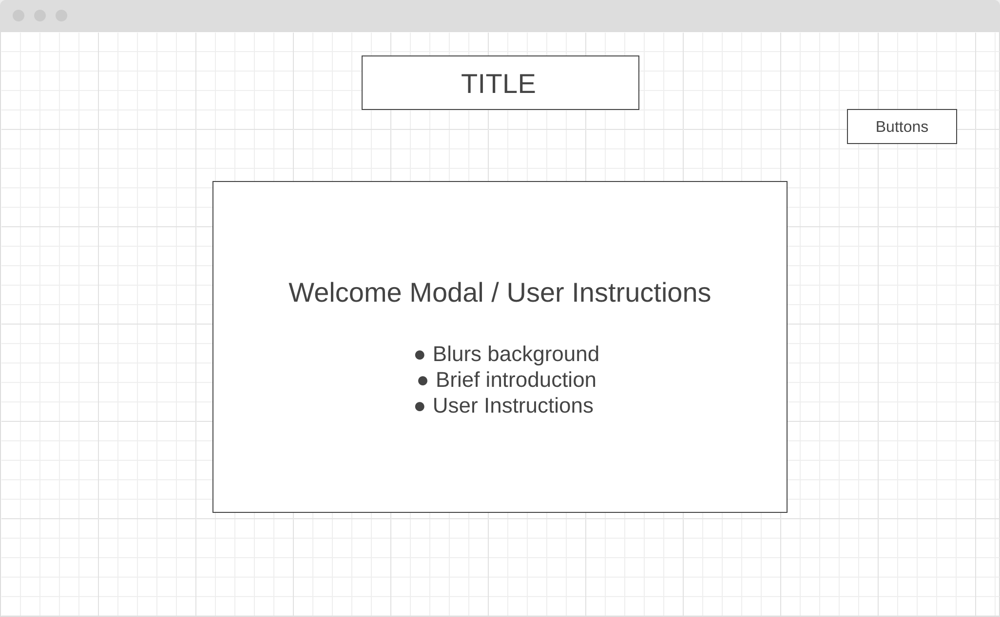
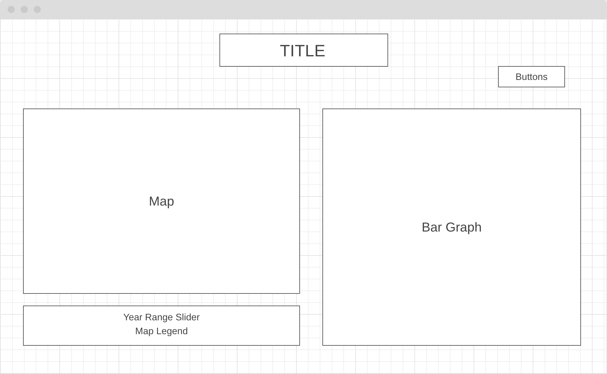
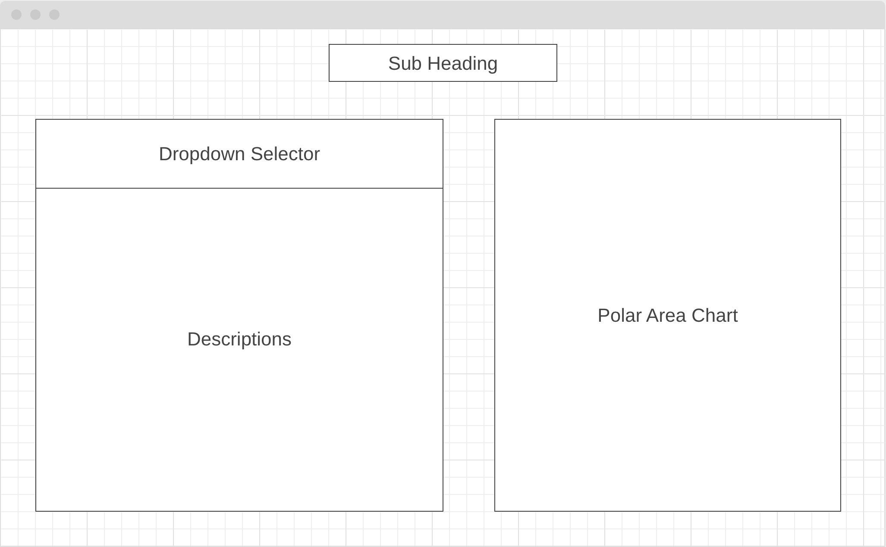

## Background
Smile Map is a data visualization project reporting data by The World Happiness Report via 2D chloropleth map, bar graph, and polar area chart. The World Happiness Report is a landmark survey of the state of global happiness that ranks 156 countries by how happy their citizens perceive themselves to be. This project allows for the visual categorization of this data via region, year, and factors affecting happiness. 

## Functionality & MVPs
In Smile Map, users will be able to:
- View color coordinated data on a 2d map chloropleth
- Hover over a country for a popup including its ranking and happiness index
- Hover over a key on the legend to see all countries included in that data
- Use the slider to propagate data for each year from 2015-2023
- Click a country to add onto the bar graph to compare the happiness index with other countries' indexes
- Click a country on the map or select a country from the dropdown to propogate the polar area chart with data used to calculate the happiness index for 2023
- Click the description tabs to read more about the factors contributing to the happiness index score, specifically for 2023

## Wireframes

## Technologies, Libraries, APIs
- Vanilla Javascript
- Chart JS
- Data fetched locally on JSON files

Implementation Timeline

Thursday & Friday: Work on hovering effect and data rendering on maps
Weekend: Allow selection of region to propogate on line graphs
Monday: Color code maps and graphs
Tuesday: Work on CSS styling and banners for data
Wednesday: Create smooth transitions from world map to USA map
Thursday Morning: Final touches
