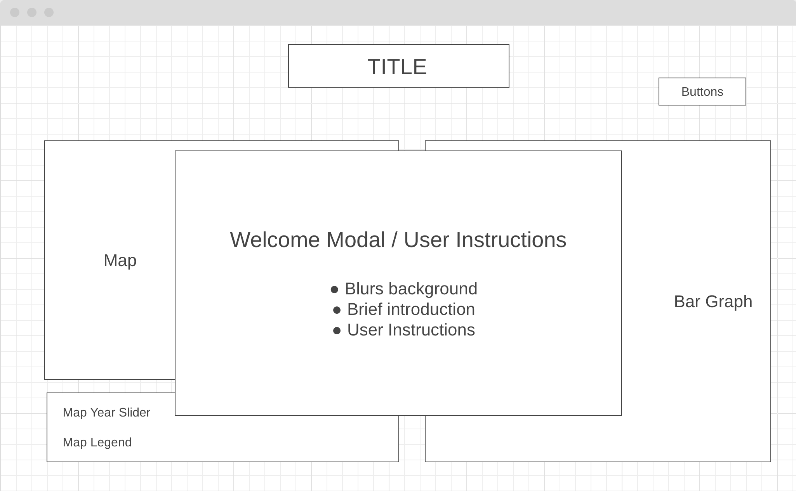

## Background
Smile Map is a data visualization project reporting data by The World Happiness Report via 2D chloropleth map, bar graph, and polar area chart. The World Happiness Report is a landmark survey of the state of global happiness that ranks 156 countries by how happy their citizens perceive themselves to be. This project allows for the visual categorization of this data via region, year, and factors affecting happiness. 

 <a href="https://michelleeli.github.io/Smile-Map/">Live Link!</a>

## Functionality & MVPs
In Smile Map, users will be able to:
- View color coordinated data on a 2d map chloropleth
- Hover over a country for a popup including its ranking and happiness index
    - Data from local JSON file is parsed to fetch data on individual regions to create a popup event when hovered over. The data is based on the value of the year on the slider and the country hovered over
``` 
  function getIndex(countryName) {
    let currentyear = slider.value
    for (let i = 0; i < data.length; i ++) {
      if (data[i]['Country'] === countryName && data[i]['Year'] === parseInt(currentyear)) {
        return data[i]['Index'];
      }
    }
  }

  function getRank(countryName) {
    let currentyear = slider.value
    for (let i = 0; i < data.length; i ++) {
      if (data[i]['Country'] === countryName && data[i]['Year'] === parseInt(currentyear)) {
        return data[i]['Rank'];
      }
    }
  }


  function createPopup(event) {
      const countryName = event.target.getAttribute('title');
      let x = event.clientX;  
      let y = event.clientY; 

      if (getIndex(countryName)) {
        popup.innerHTML = `<p> Country: ${countryName}</p><p>Index: ${getIndex(countryName)}</p> Rank: ${getRank(countryName)}`;
      } else {
        popup.innerHTML = `<p>Country:${countryName}<p><p> No data </p>`
      }
      popup.style.display = 'block';
      popup.style.left = x + 'px';
      popup.style.top = y + 'px';
  }
``` 
- Hover over a key on the legend to see all countries included in that data
- Use the slider to propagate data for each year from 2015-2023
- Click a country to add onto the bar graph to compare the happiness index with other countries' indexes
- Click a country on the map or select a country from the dropdown to propogate the polar area chart with data used to calculate the happiness index for 2023 using Chart JS
```
    paths.forEach(path => {
        path.addEventListener('click', updateChart)
      })

    let circlegraph = new Chart(circle,{
    type: 'polarArea',
    data: {
        labels: [ "Social Support", "Freedom to Make Life Choices", "Generosity", "Perceptions of Corruption"],
        datasets:[{
            data: [0.919, 0.8, 0.137, 0.689],
            borderWidth: 1,
            backgroundColor: ['rgba(246, 189, 96, 0.85)', 'rgba(247, 237, 226, 0.7)', 'rgba(245, 202, 195, 0.85)', 'rgba(175, 62, 77, 0.85)', 'rgba(242, 132, 130, 0.85)']
        }]
    },
    options: {}
    })


    function updateChart(e){
        let countryName = e.target.getAttribute('title');
        circlegraph.data.labels = [];
        circlegraph.data.datasets.forEach((dataset) => {
          dataset.data = [];
      });
        for (let i = 0; i < circledata.length; i++){
            if (circledata[i].Country === countryName) {
                addData(circlegraph, "Social Support", social[i])
                addData(circlegraph, "Freedom to Make Life Choices", freedom[i])
                addData(circlegraph, "Generosity", generosity[i])
                addData(circlegraph, "Perceptions of Corruption", corruption[i])
                info.innerText = `Healthy Life Expectancy: ${life[i]} \n Logged GDP per capita: ${gdp[i]}`
            }
        }
    }
```
- Click the description tabs to read more about the factors contributing to the happiness index score, specifically for 2023
- Open and close modal for user instructions 

## Wireframes



- Buttons include information button to open modal as well as link to developer's Github page
- Descriptions include tabs that can be toggled to change the description rendered 

## Technologies, Libraries, APIs
- Vanilla Javascript
- Chart JS
- Data fetched locally on JSON files

## Implementation Timeline
- Thursday: 
    - Implement SVG map onto HTML
    - Convert data into JSON files to fetch for map and bar graph
    - Create popup when hovering over country
    - Style paths and hover effects with CSS 
- Friday: 
    - Create bar graph with default data using Chart JS
    - Allow selection of country to propogate and remove data from bar graph
    - Create map legend to allow hover over country to select area on legend as well as hover over key to select map areas
    - Make slider to change data on graph by year
- Monday: 
    - Convert data into JSON files to fetch for polar area chart
    - Create dropdown to select country for chart visualization
    - Allow for data to change by clicking the map 
-Tuesday: 
    - Create modal for user instructions
    - Create tabs and descriptions for factors represented on polar area chart
    - Style page with same theme for all segments
- Wednesday: 
    - Create buttons for developer links and modal information
- Thursday Morning: 
    - Finish production ReadMe
